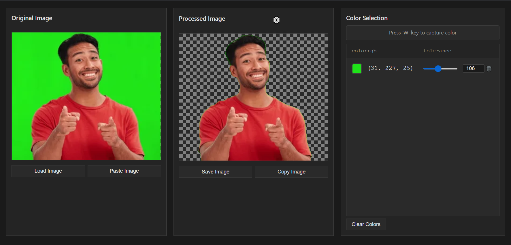

# Image Background Remover

Hobby Project - Electron application for removing backgrounds from images using color-based selection.



## Features

- Color picker tool (Press 'W' key)
- Adjustable color tolerance
- Support for PNG, JPG, and JPEG images
- Copy/Paste support
- Customizable background display (checkerboard or solid color)
- Automatic settings persistence
- Real-time preview

## Prerequisites

Before you begin, ensure you have the following installed:
- [Node.js](https://nodejs.org/) (v16 or higher)
- [Python](https://www.python.org/) (v3.8 or higher)
- [Git](https://git-scm.com/)

## Installation

1. Clone the repository:
```bash
git clone https://github.com/Johannes-T-E/ImageBackgroundRemover.git
cd ImageBackgroundRemover
```

2. Set up Python virtual environment:
```bash
# Create virtual environment
python -m venv venv

# Activate virtual environment
# On Windows:
venv\Scripts\activate
# On macOS/Linux:
source venv/bin/activate

# Install Python dependencies
pip install -r requirements.txt
```

3. Install Node.js dependencies:
```bash
npm install
```

## Running the Application

1. Make sure your Python virtual environment is activated (see step 2 above)

2. Start the application:
```bash
# For development (with DevTools):
npm run dev

# For production:
npm start
```

## Usage

1. Load an image using one of these methods:
   - Click "Load Image" button
   - Press `Ctrl/Cmd + V` to paste from clipboard
   - Drag and drop an image file

2. Remove background colors:
   - Press `W` key to activate color picker
   - Click on colors in the image you want to remove
   - Adjust tolerance slider for each color
   - Colors will be removed in real-time

3. Save or copy the result:
   - Click "Save" button to save as PNG
   - Press `Ctrl/Cmd + C` to copy to clipboard

### Keyboard Shortcuts

- `W` - Activate color picker
- `Ctrl/Cmd + C` - Copy processed image
- `Ctrl/Cmd + V` - Paste image from clipboard
- `Ctrl/Cmd + S` - Save processed image

## Development

### Building from Source

1. Install dependencies:
```bash
# Install Node.js dependencies
npm install

# Set up Python environment and dependencies
python -m venv venv
.\venv\Scripts\activate  # On Windows
source venv/bin/activate  # On macOS/Linux
pip install -r requirements.txt
```

2. Build the application:
```bash
# Build for your current platform
npm run build

# The built application will be in the dist/win-unpacked directory (Windows)
# or dist/mac (macOS) or dist/linux-unpacked (Linux)
```

3. Running the built application:
- Windows: Run `dist/win-unpacked/imagebackgroundremover.exe`
- macOS: Run `dist/mac/Image Background Remover.app`
- Linux: Run `dist/linux-unpacked/imagebackgroundremover`

### Development Mode

For development with hot-reload and DevTools:
```bash
npm run dev
```

### Project Structure

- `src/` - Source code directory
  - `backend/` - Python backend service
  - `ui/` - Electron frontend
- `temp/` - Temporary files (created automatically)
- `assets/` - Application assets
- `dist/` - Built application (created by build process)

## Contributing

1. Fork the repository
2. Create your feature branch (`git checkout -b feature/amazing-feature`)
3. Commit your changes (`git commit -m 'Add some amazing feature'`)
4. Push to the branch (`git push origin feature/amazing-feature`)
5. Open a Pull Request

## License

This project is licensed under the ISC License - see the [LICENSE](LICENSE) file for details.

## Acknowledgments

- OpenCV for image processing
- Electron for the desktop framework
- NumPy for numerical computations 